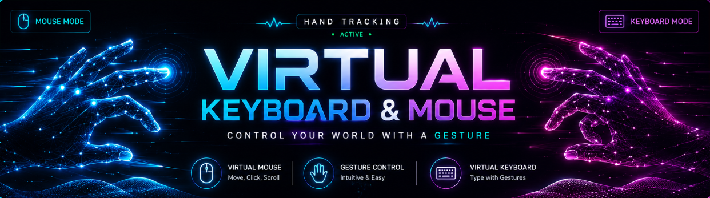

<p align="center">
  
</p>

# 🖐️ Virtual Keyboard & Mouse

A computer vision-based **Virtual Keyboard and Mouse** that allows users to control their computer using **hand gestures** without a physical keyboard or mouse.

The project uses **MediaPipe Hand Tracking**, **OpenCV**, and **PyAutoGUI** to detect hand landmarks and convert gestures into keyboard and mouse actions.

---

## ✨ Features

### 🖱️ Virtual Mouse
- Move the cursor using your index finger
- Left click using thumb + index finger pinch
- Right click using thumb + middle finger pinch
- Hold pinch to drag
- Scroll using index + middle finger movement

### ⌨️ Virtual Keyboard
- Type characters using hand gestures
- Virtual QWERTY keyboard displayed through OpenCV
- Hover over keys using the index finger
- Pinch thumb + index finger to press a key
- CAPS LOCK support
- SHIFT support
- SPACE
- BACKSPACE
- ENTER
- CLEAR

### 🔄 Mode Switching
Switch between Mouse and Keyboard modes using hand gestures:

- ☝️ One finger → Mouse Mode
- ✌️ Two fingers → Keyboard Mode

The gesture must be held for a short duration to prevent accidental mode switching.

---

## 🛠️ Tech Stack

| Technology | Purpose |
|---|---|
| Python | Core programming language |
| OpenCV | Camera feed and visual interface |
| MediaPipe | Hand landmark detection |
| PyAutoGUI | Controlling mouse and keyboard |
| NumPy | Numerical operations |

---

## 📂 Project Structure

```text
Virtual-Keyboard-Mouse/
│
├── assets/
│   └── hand_landmarker.task
│
├── modules/
│   ├── hand_tracker.py
│   ├── virtual_keyboard.py
│   ├── virtual_mouse.py
│   └── .gitignore
│
├── main.py
├── requirements.txt
└── README.md
