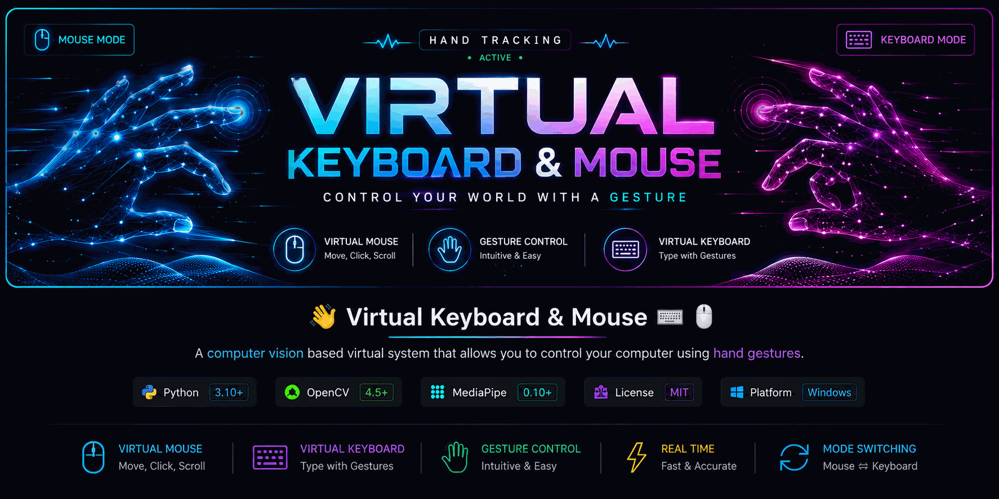

<p align="center">
  
</p>

<p align="center">

  <a href="https://github.com/Deepak1Gautam/Virtual-Keyboard-Mouse">
    
  </a>

  <a href="https://github.com/Deepak1Gautam/Virtual-Keyboard-Mouse#-run-locally">
  
</a>

</p>

<h1 align="center">🖐️ Virtual Keyboard & Mouse</h1>

<p align="center">
  <b>Control your computer using hand gestures — no physical keyboard or mouse required.</b>
</p>

<p align="center">
  A real-time computer vision project built with Python, OpenCV, MediaPipe and PyAutoGUI.
</p>

<p align="center">

<a href="https://github.com/Deepak1Gautam/Virtual-Keyboard-Mouse">
  
</a>

<a href="YOUR_LINKEDIN_PROFILE_URL">
  
</a>

<a href="#-live-demo--run-locally">
  
</a>

</p>

<p align="center">
  
  
  
  
</p>

<p align="center">
  
  
  
</p>

---

## 📌 About The Project

**Virtual Keyboard & Mouse** is a computer-vision-based Human-Computer Interaction (HCI) project that allows users to control their computer using hand gestures.

The system uses **MediaPipe hand landmark detection** to track hand movements and **OpenCV** to process the webcam feed in real time.

The project provides two main interaction modes:

- 🖱️ **Virtual Mouse**
- ⌨️ **Virtual Keyboard**

Users can switch between these modes using simple hand gestures.

The goal of this project is to create a **touch-free computer interaction system** using real-time computer vision.

---

## ✨ Features

### 🖱️ Virtual Mouse

Control your computer mouse using hand gestures.

- ☝️ **Index Finger** → Move cursor
- 🤏 **Index + Thumb Pinch** → Left click
- ✊ **Hold Pinch** → Drag & drop
- 🤏 **Thumb + Middle Finger Pinch** → Right click
- ↕️ **Index + Middle Fingers Apart** → Scroll
- ⚡ Smooth cursor movement
- 🎯 Gesture-based interaction
- 🖱️ Real-time mouse automation

---

### ⌨️ Virtual Keyboard

Type on your computer without touching a physical keyboard.

- ☝️ **Index Finger** → Hover over a key
- 🤏 **Thumb + Index Pinch** → Press key
- 🔠 **CAPS** → Toggle uppercase
- ⇧ **SHIFT** → Temporary uppercase
- ␣ **SPACE** → Insert space
- ⌫ **BACKSPACE** → Delete character
- ↵ **ENTER** → Press Enter
- 🧹 **CLEAR** → Clear typed text

---

### 🎯 Smart Interaction

- 🔄 Mouse ↔ Keyboard mode switching
- 🖐️ Real-time hand landmark tracking
- 📊 Real-time FPS counter
- 🟢 Live gesture status
- 📋 Current action display
- 🎨 Transparent UI panels
- ⏱️ Gesture hold detection
- ⚡ Click and keypress cooldown system
- 🎯 Cursor smoothing
- 📷 Real-time webcam processing

---

## 🧠 Gesture Controls

| Gesture | Action | Mode |
|---|---|---|
| ☝️ Index Finger | Move Cursor | 🖱️ Mouse |
| 🤏 Index + Thumb Pinch | Left Click | 🖱️ Mouse |
| ✊ Hold Index + Thumb Pinch | Drag & Drop | 🖱️ Mouse |
| 🤏 Thumb + Middle Pinch | Right Click | 🖱️ Mouse |
| ↕️ Index + Middle Apart | Scroll | 🖱️ Mouse |
| ✌️ Index + Middle Hold | Switch to Keyboard | 🔄 Switch |
| ☝️ Index Finger | Hover / Select Key | ⌨️ Keyboard |
| 🤏 Thumb + Index Pinch | Type Key | ⌨️ Keyboard |
| 🔠 CAPS | Toggle Uppercase | ⌨️ Keyboard |
| ⇧ SHIFT | Temporary Uppercase | ⌨️ Keyboard |
| ␣ SPACE | Insert Space | ⌨️ Keyboard |
| ⌫ BACKSPACE | Delete Character | ⌨️ Keyboard |
| ↵ ENTER | Press Enter | ⌨️ Keyboard |
| 🧹 CLEAR | Clear Text | ⌨️ Keyboard |
| ☝️ Index Finger Hold | Switch to Mouse | 🔄 Switch |

> 💡 **Tip:** Hold the required mode-switch gesture for a short moment to prevent accidental switching.

---

## 🛠️ Tech Stack

| Technology | Purpose |
|---|---|
| 🐍 **Python** | Core programming language |
| 👁️ **OpenCV** | Webcam processing and visual interface |
| 🖐️ **MediaPipe** | Hand landmark detection and tracking |
| 🖱️ **PyAutoGUI** | Mouse and keyboard automation |
| 🔢 **NumPy** | Numerical operations |
| 📷 **Webcam** | Real-time hand input |

---

## 🏗️ Project Architecture

```text
Virtual-Keyboard-Mouse/
│
├── 📁 assets/
│   ├── hand_landmarker.task
│   └── banner.gif
│
├── 📁 modules/
│   ├── hand_tracker.py
│   ├── virtual_keyboard.py
│   ├── virtual_mouse.py
│   └── .gitignore
│
├── 📄 main.py
├── 📄 requirements.txt
└── 📄 README.md
